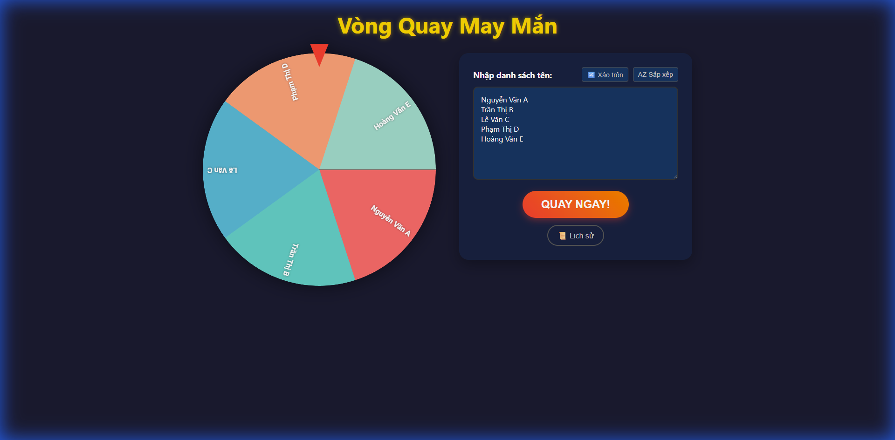
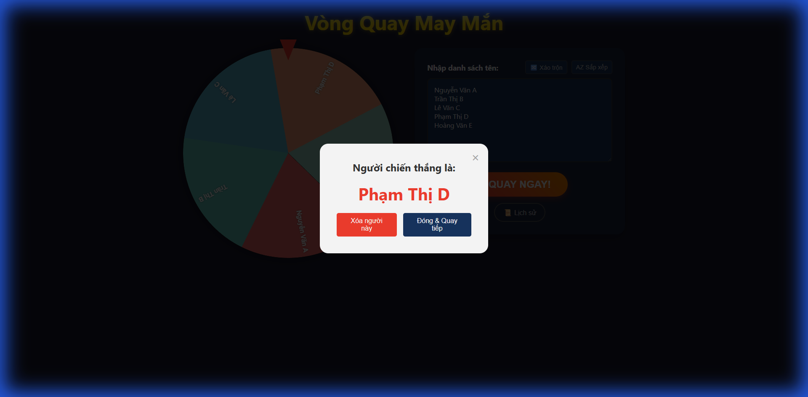
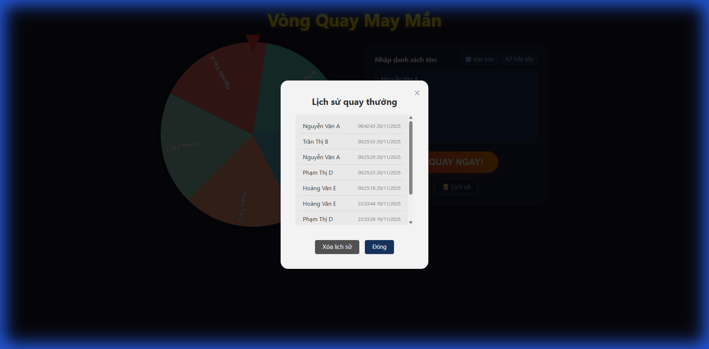

# Vòng Quay May Mắn (Lucky Wheel Game)

Game vòng quay may mắn hoàn toàn offline với giao diện đẹp mắt và nhiều tính năng.

## 📸 Screenshots

### Giao diện chính

*Giao diện game với vòng quay và danh sách người tham gia*

### Kết quả quay thưởng

*Modal hiển thị người chiến thắng với hiệu ứng pháo giấy*

### Lịch sử quay thưởng

*Danh sách lịch sử các người đã thắng*

## 🎯 Tính năng

- ✨ Vòng quay động với hiệu ứng vật lý mượt mà
- 🎊 Hiệu ứng pháo giấy khi có người thắng
- 🔀 Xáo trộn danh sách ngẫu nhiên
- 🔤 Sắp xếp A-Z hoặc Z-A (hỗ trợ tiếng Việt)
- 📜 Lưu lịch sử người thắng (localStorage)
- 🗑️ Xóa người vừa thắng khỏi danh sách
- 📱 Responsive - hoạt động tốt trên mobile
- 🌐 **Hoàn toàn offline** - không cần kết nối internet

## 🎨 Giao diện (UI Design)

Game được thiết kế với giao diện hiện đại, bắt mắt:

- **Màu sắc**: Sử dụng bảng màu tối (dark theme) sang trọng với điểm nhấn vàng gold
- **Font chữ**: Sử dụng system fonts (-apple-system, BlinkMacSystemFont, Segoe UI, Arial) để đảm bảo hiển thị tốt trên mọi thiết bị
- **Vòng quay**: Canvas động với 8 màu sắc rực rỡ, tự động chia đều theo số lượng người tham gia
- **Modal**: Hiệu ứng pop-up mượt mà với animation khi hiển thị kết quả
- **Responsive**: Layout tự động điều chỉnh từ desktop (1920px) xuống mobile (375px)
- **Micro-interactions**: Hiệu ứng hover, shadow, và transitions cho trải nghiệm mượt mà

### Màu sắc chủ đạo:
- Primary (Gold): `#FFD700`
- Secondary (Red): `#FF4136`
- Background: `#1a1a2e`
- Panel: `#16213e`
- Input: `#0f3460`

## 🚀 Cách chạy

### Phương án 1: Mở trực tiếp (File Protocol)
Đơn giản nhất, chỉ cần mở file `index.html` bằng trình duyệt.

### Phương án 2: Dùng HTTP Server (Khuyến nghị)
Chạy trên server local để tránh các vấn đề với CORS và localStorage.

```bash
# Cài đặt dependencies (chỉ cần làm 1 lần)
npm install

# Khởi động server
npm start
```

Server sẽ tự động mở trình duyệt tại `http://localhost:8080`

### Phương án 3: Dùng extension Live Server (VS Code)
Nếu bạn dùng VS Code, có thể cài extension "Live Server" và click chuột phải vào `index.html` → "Open with Live Server".

## 📁 Cấu trúc thư mục

```
lucky-wheel-game/
├── index.html              # File HTML chính
├── assets/
│   ├── css/
│   │   └── style.css      # Stylesheet
│   └── js/
│       ├── script.js      # Logic game
│       └── confetti.browser.min.js  # Thư viện pháo giấy
├── package.json           # NPM configuration
├── user_data.txt         # Dữ liệu mẫu
└── README.md             # File này
```

## 🎮 Cách sử dụng

1. Nhập danh sách tên (mỗi tên một dòng) vào ô textarea
2. Click **"QUAY NGAY!"** để quay vòng quay
3. Chờ vòng quay dừng lại để xem người chiến thắng
4. Có thể xóa người vừa thắng khỏi danh sách để quay tiếp
5. Xem lịch sử người đã thắng bằng nút **"📜 Lịch sử"**

## 🛠️ Công nghệ sử dụng

- **HTML5 Canvas**: Vẽ vòng quay động
- **Vanilla JavaScript**: Logic game
- **CSS3**: Styling và animations
- **canvas-confetti**: Hiệu ứng pháo giấy
- **localStorage**: Lưu lịch sử
- **http-server**: Development server

## 📝 Ghi chú

- Tất cả dữ liệu được lưu cục bộ trên trình duyệt (localStorage)
- Game hoạt động hoàn toàn offline
- Hỗ trợ đầy đủ tiếng Việt (bao gồm dấu)
- Responsive design - chạy tốt trên mọi thiết bị

## 🤖 Công cụ phát triển

Dự án này được xây dựng với sự hỗ trợ của **Google Antigravity** - AI coding assistant mạnh mẽ từ Google DeepMind.

- **AI Agent**: Google Antigravity
- **IDE**: Visual Studio Code
- **Workflow**: Agentic AI-assisted development

## 📄 License

MIT License - Tự do sử dụng và chỉnh sửa
